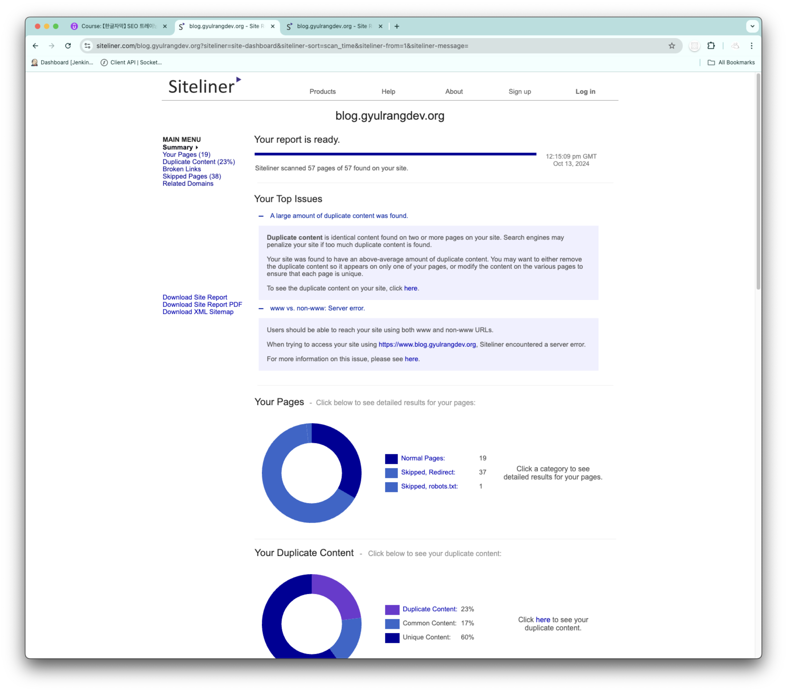
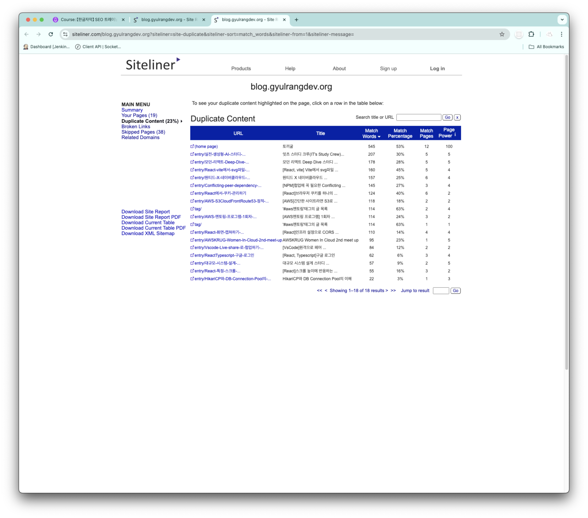
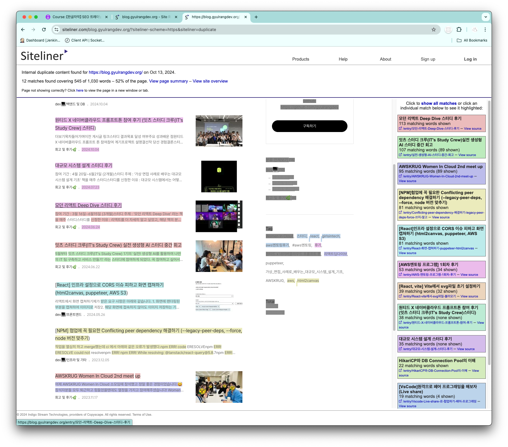

# 중복 콘텐츠

중복 콘텐츠로 인한 검색 순위 하락할 수 있다.

## 발생 원인

- HTTP에서 HTTPS로 프로토콜 전환
  - http://site.com vs https://site.com
  - www.site.com vs site.com
  - site.com vs site.com/
- 웹사이트 리디자인 또는 새 웹사이트로 전환
- 오래된 블로그 포스트나 제품 페이지 축적
- 유사한 제품 페이지 다수 존재
- 더 이상 판매되지 않는 제품 페이지
- 관련성 없는 블로그 포스트

## 중복 콘텐츠 해결 방법

1. 메타 태그 사용
   - `<meta name="robots" content="noindex">`를 페이지 헤더에 추가
   - 검색 엔진 크롤러에게 해당 페이지를 색인하지 말라고 지시
2. robots.txt 파일 활용
   - 웹사이트 루트 디렉토리에 위치
   - 크롤러에게 크롤링하지 말아야 할 부분 지정
3. 정규 태그(canonical tag) 사용
   - `<link rel="canonical" href="https://www.example.com/sample-page/">`
   - 여러 URL 버전 중 주요 버전 지정
   - 유사한 콘텐츠의 페이지에서 주요 버전 지정
4. 301 리다이렉트
   - 페이지를 영구적으로 이동할 때 사용
   - 이전 페이지의 SEO 강도를 새 페이지로 전달

## Google Search Console을 이용한 자체 사이트 중복 콘텐츠 확인

1. Google Search Console 접속
2. 왼쪽 메뉴에서 '성과' 탭 선택
3. '페이지' 쿼리 확인
   - HTTPS vs HTTP 버전 중복 확인
   - www vs non-www 버전 중복 확인 (선택하지 않은 버전에서 선택한 버전으로 301 리다이렉트를 설정해야 함.)
   - 기타 URL 구조의 중복 확인

## 외부 웹사이트와의 중복 콘텐츠 확인 방법

1. Copyscape 사용
   - 무료 표절 검사 도구
   - URL 입력 후 중복 여부 확인
2. 기타 표절 검사 도구 활용

   - https://www.grammarly.com/plagiarism-checker

3. Siteliner 활용
   - https://www.siteliner.com/
   - 한국 사이트도 잘 책정해줌

## 중복 콘텐츠 평가

- 일부 중복은 허용 가능
  - 브랜드 설명, 자기 소개 등
- 주의해야 할 중복
  - 대규모 텍스트 블록의 중복
  - 원래 독창적이어야 할 내용의 중복

## 왜 해야하나?

- Google 페널티 위험 감소
- 좋은 페이지만 인덱싱되도록 보장
- 웹사이트의 전반적인 SEO 순위 향상
- 즉시 실행 가능한 온페이지 SEO 전략

# Google Search Console을 이용한 웹사이트 분석 및 개선 방법

- 단순히 많은 페이지보다는 적지만 고품질 페이지 유지가 중요
- 지속적인 모니터링과 개선으로 웹사이트의 전반적인 SEO 성과 향상
- Google이 웹사이트를 권위 있는 사이트로 인식하도록 관리

# 저품질 콘텐츠 제거의 이점과 방법

## 저품질 콘텐츠

- 오래된 페이지
- 관리되지 않는 콘텐츠
- 게스트 블로그 포스트 (특히 품질이 낮은 경우)
- 얇은 콘텐츠 (thin content)
- 의심스러운 사이트로 링크
- 트래픽이 없는 페이지

## 저품질 콘텐츠를 제거하자

1. Google Search Console에서 제거 요청
   - 'Removals' 섹션에서 새 요청 추가
   - URL 입력 후 제거 요청
2. 웹사이트에서 실제 페이지 삭제
3. 사이트맵 업데이트
   - 삭제된 페이지가 사이트맵에서 제거되었는지 확인
4. 내부 링크 점검 및 수정
   - 삭제된 페이지로의 링크 확인
   - 깨진 링크 수정 또는 제거
