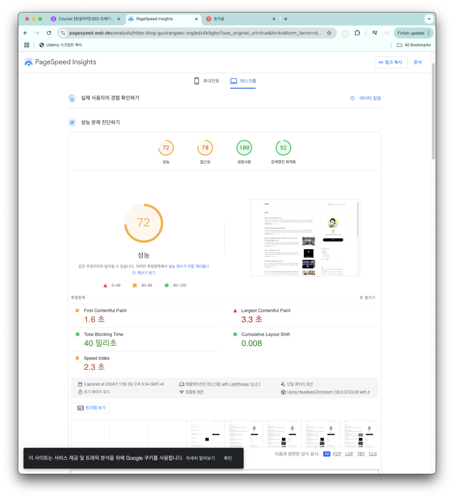

# 웹사이트 속도 최적화의 중요성

## 웹사이트 속도 향상의 이점

- Google이 빠른 웹사이트 선호
- 검색 순위 상승
- 고객 및 구매자 증가
- 더 많은 트래픽 확보 가능
- 이메일 리스트 구축 용이
- 사용자 경험 개선
- 웹사이트 탐색 용이성 증가
- 사용자 이탈률 감소

## Google PageSpeed Insights

https://pagespeed.web.dev/analysis?utm_source=psi&utm_medium=redirect&url&hl=ko

- Google에서 제공하는 공식 도구
- URL 입력 후 간단한 분석 가능
- 구체적인 개선 방안 제시
  - 예: 미사용 JavaScript 제거
  - 텍스트 압축 활성화 등

블로그로 테스트 해보니 71/100점 획득

## WebPageTest

https://www.webpagetest.org/

Core Web Vitals,
Site Performance,
Lighthouse,
Visual Comparison 확인 가능

## GTmetrix

https://gtmetrix.com/

- 상세한 성능 분석 제공

## Lighthouse

- Chrome 브라우저 내장 도구
- 접근 방법:
  1. Chrome 메뉴(점 3개) → 더 많은 도구 → 개발자 도구
  2. Lighthouse 탭 선택
  3. 모바일/데스크톱 옵션 선택
  4. 보고서 생성
- 익명 모드 사용 권장 (확장 프로그램 영향 배제)

## 측정 시 주의사항

- 도구마다 결과가 다를 수 있음
- 측정 시점에 따라 결과 변동 가능
  - 서버 부하
  - 호스팅 상태
  - 시간대별 트래픽
- 개선 사항 적용 시 전체 사이트 영향 고려 필요

## 성능 개선 포인트

- JavaScript 최적화
- 텍스트 압축
- 로딩 시간 단축
- 전문가의 경우 하루 정도면 대부분의 문제 해결 가능

# 웹사이트 속도 최적화의 기술적 이해

## DOM(Document Object Model) 개요

- 정의: 브라우저가 HTML을 파싱하여 만드는 문서 객체 모델
- 주요 기능:
  - HTML 파싱
  - 스크립트, 이미지, CSS 파일 식별
  - 웹페이지 렌더링을 위한 구조화

## 중요 렌더링 경로

### 작동 방식

- HTML을 위에서 아래로 순차적 처리
- 다음 요소들을 순차적으로 처리:
  - HTML 구조
  - CSS 파일
  - JavaScript 파일
  - 외부 리소스

### 렌더링 차단 요소

1. 외부 호출

   - 타사 라이브러리
   - 외부 웹사이트 리소스
   - 느린 서버 응답

2. 내부 요소
   - 대용량 JavaScript 파일
   - 최적화되지 않은 CSS
   - 고해상도 이미지

## 최적화 전략

### 이미지 최적화

- 적절한 해상도 선택
- 이미지 압축 활용
- 필요한 곳에만 고해상도 사용

### 코드 최적화

- 불필요한 JavaScript/CSS 제거
- 외부 리소스 호출 최소화
- 텍스트 위주의 콘텐츠 활용

### 80/20 규칙 적용

- 간단한 20%의 변화로 80%의 성능 향상
- 기본적인 최적화부터 시작
- 복잡한 기술적 최적화는 필요한 경우만

## 실행 팁

- 24시간 내 주요 페이지 최적화 가능
- 불필요한 레거시 코드 제거
- 필수 요소만 유지
- 텍스트 기반 콘텐츠 활용
