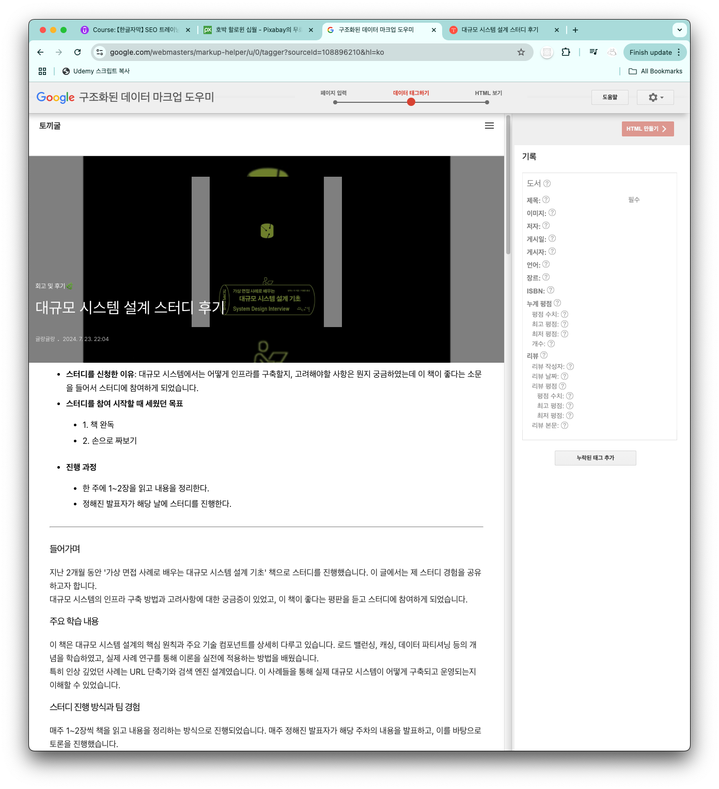
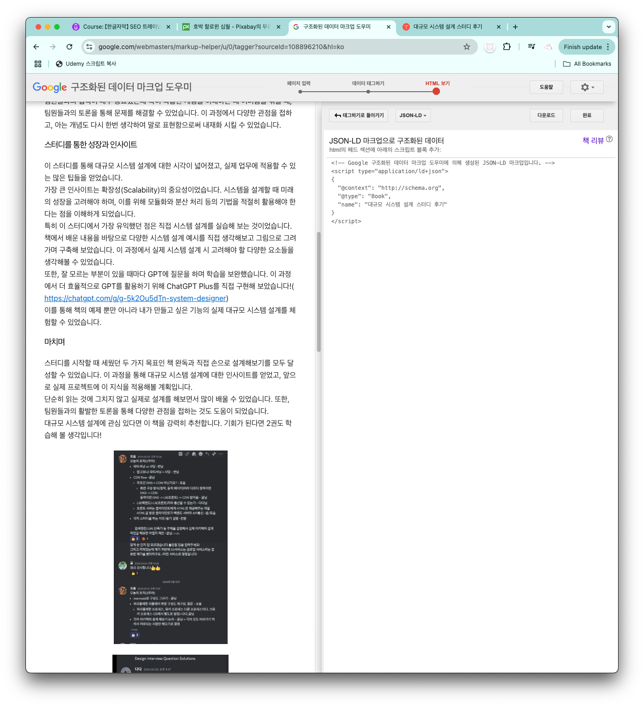

# 리치 스니펫(Rich Snippets) 소개

## 리치 스니펫 정의

- 구글 검색 결과에서 일반 텍스트 이상의 추가 정보를 보여주는 향상된 검색 결과 표시 방식
- 웹페이지의 구조화된 데이터를 활용하여 더 풍부한 정보를 제공

- WebMaster 도구
- https://google.com/webmasters/markup-helper
  

- Schema.org 형식
  https://schema.org/

- JSON-LD 형식
  

## 리치 스니펫의 중요성

1. 시각적 효과

   - 별점 표시 기능
   - 검색 결과 공간 확대
   - 시선 집중 효과

2. 경쟁 우위
   - 일반 검색 결과와 차별화
   - 클릭률(CTR) 향상
   - 신뢰도 증가

## 향후 학습 내용

1. 구현 방법

   - 리치 스니펫 설정
   - 추천 스니펫 활용
   - 최적화 전략

2. 적용 가능 분야
   - 상황별 활용법
   - 제한사항 이해
   - 효과적인 활용 전략

## 기대 효과

- 검색 결과 매력도 상승
- 사용자 관심도 증가
- 클릭 전환율 향상

## 주의사항

- 모든 상황에 적용 불가
- 적절한 활용 필요
- 지속적인 관리 중요
